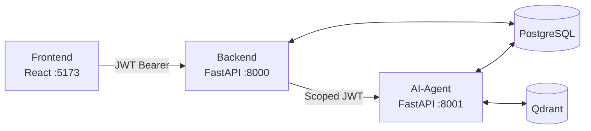

# ARCHITECTURE.md — Health Signal

## 1. Architecture Summary

Health Signal is a **three-service web application**:

| Service | Stack | Port | Role |
|---------|-------|------|------|
| `frontend` | React 18 + Vite + TypeScript | 5173 | User interface |
| `backend` | FastAPI + PostgreSQL + SQLAlchemy (async) | 8000 | Auth, data persistence, AI-agent proxy |
| `ai-agent` | FastAPI + Qdrant + LangGraph | 8001 | Document ingestion pipeline, LLM supervisor, RAG |

**Architectural pattern:** The backend acts as the only public-facing API. The frontend talks exclusively to the backend. The backend proxies AI requests to the ai-agent, which stays on an internal port. All authentication is enforced at the backend; the backend mints a scoped token for each ai-agent call.

**AI model:** All LLM calls use OpenAI via LangChain (`ChatOpenAI`, default model `gpt-4.1-nano`, configurable). The config also contains `anthropic_api_key` but it is not visibly used in any current code — status unclear. Embeddings use `intfloat/multilingual-e5-large` via FastEmbed (CPU, local, ~130 MB).

**Observability:** LangSmith tracing is wired into every LLM call via `LangChainTracer` callbacks. Enabled by setting `LANGCHAIN_TRACING_V2=true` and `LANGSMITH_API_KEY`.

---

## 2. Project Structure

```
health-signal/
├── frontend/          # React/Vite SPA
│   └── src/
│       ├── api/           # backend.ts — typed fetch wrappers for all endpoints
│       ├── components/    # ChatInput, Layout, MessageBubble, SourcePanel, TabNav, ...
│       ├── context/       # AuthContext.tsx — JWT state + login/register/logout
│       ├── hooks/         # useChat.ts, useReport.ts — all stateful logic
│       ├── pages/         # ChatPage, UploadPage, ReportPage, LoginPage
│       └── types/         # Shared TypeScript interfaces
│
├── backend/           # FastAPI + PostgreSQL
│   ├── api/routes/        # One file per resource (auth, documents, lab_results, ...)
│   ├── models/            # SQLAlchemy ORM models
│   ├── repositories/      # DB access layer (one class per model group)
│   ├── services/          # Business logic (DocumentService, TimelineService)
│   ├── schemas/           # Pydantic request/response schemas
│   ├── core/              # config.py, security.py, logger.py
│   ├── db/                # session.py (async engine), base.py (DeclarativeBase)
│   └── alembic/           # Database migrations
│
├── ai-agent/          # FastAPI + Qdrant + LangGraph
│   ├── api/routes/        # ingest.py, query.py, report.py
│   ├── agents/            # LangGraph agents + supervisor
│   ├── ingestion/         # pipeline.py, parser.py, chunker.py, embedder.py
│   ├── rag/               # retriever.py, query_chain.py, writer.py
│   ├── tools/             # LLM-based extractors (lab, symptom, supplement, classifier)
│   └── core/              # config.py, guardrails.py, language.py, security.py
│
├── tests/e2e/         # Integration tests against live services
├── docs/              # Flow diagrams (Mermaid .md and PPTX)
└── eval/              # Eval framework: versioned test suites, seed script, reports
```

---

## 3. Main Components

### Frontend

- **Framework:** React 18, Vite, TypeScript — no component library (all inline styles with CSS variables)
- **State:** Local component state + two custom hooks (`useChat`, `useReport`)
- **Auth:** `AuthContext` — JWT stored in `localStorage` under `hs_token`; 401 responses auto-clear the token and reload
- **Session persistence:** `useChat` persists the active session and session history to `localStorage`; server-side history is the source of truth for AI context
- **Streaming:** `sendQueryStream` in `backend.ts` opens a native `fetch` stream and parses SSE `data:` lines manually
- **Pages:** three tabs — Chat, Upload, Doctor Report — gated behind `LoginPage`
- **Config:** `VITE_BACKEND_URL` env var (defaults to `http://localhost:8000`)

### Backend

- **Framework:** FastAPI, async-first
- **Database:** PostgreSQL via SQLAlchemy (asyncpg driver); Alembic for migrations
- **Auth:** JWT (`python-jose`), bcrypt password hashing; tokens contain `user_id` as the subject
- **Proxy role:** `/ai/*` routes forward requests to the ai-agent, injecting a freshly minted token so the ai-agent can call backend routes back
- **CORS:** Enabled only when `ENVIRONMENT=dev`; not configured for production
- **File storage:** Uploaded files written to local disk (`./uploads/` by default); stored with a UUID prefix

### AI-Agent

- **Framework:** FastAPI, async-first
- **LLM:** `ChatOpenAI` (LangChain); model configured via `OPENAI_MODEL` (default `gpt-4.1-nano`)
- **Orchestration:** LangGraph `StateGraph` for the supervisor and all sub-agents
- **Vector store:** Qdrant running locally; single collection `health_documents`
- **Embeddings:** FastEmbed `intfloat/multilingual-e5-large` — 1024-dim, CPU-only, loaded once via `lru_cache`
- **Singletons:** `Embedder` and `Chunker` are cached with `lru_cache`; other objects are constructed per request

---

## 4. AI Agent Architecture

### Supervisor (`agents/supervisor.py`)

The entry point for all query requests. Uses a LangGraph `StateGraph` with one classification node that routes to five sub-agents.

```
classify → [lab_analysis | pattern_detection | timeline | doctor_report | rag] → END
```

**Classification prompt** (`CLASSIFY_PROMPT`): system message that defines 5 categories with examples. Uses the last 4 conversation messages as context to handle follow-up questions correctly. Falls back to `rag` on any exception.

**State (`AgentState`):** `question`, `user_id`, `session_id`, `summary`, `recent_history`, `document_type`, `answer`, `sources`, `route`

**Conversation memory:** loaded before classification, saved after the answer is ready. Summarisation is triggered asynchronously (`asyncio.create_task`) when `total_count > 14`.

**Streaming:** the `run_stream` method classifies first (non-streaming), then streams the chosen sub-agent. For `rag`, it uses `LLM.astream`. For `lab_analysis`, `pattern_detection`, `timeline`, it uses LangGraph's `astream_events(version="v2")` and forwards `on_chat_model_stream` events.

---

### Sub-agents

All structured agents (lab, pattern, timeline) use the same `create_tool_calling_graph` factory in `graph_factory.py` — a standard LangGraph ReAct loop (reason → tool call → observe → repeat).

Each agent prepends the conversation context (summary + recent history) to its message list, then appends a language enforcement message, then the question.

#### LabAnalysisAgent (`agents/lab_analysis.py`)

| Property | Value |
|----------|-------|
| Pattern | LangGraph ReAct |
| Tools | `fetch_lab_results` (GET /lab-results), `get_marker_history` (GET /lab-results/markers/{name}/history) |
| System prompt | Lab result specialist; trend analysis; reference range comparison |
| Sources | PostgreSQL `lab_results` + `lab_markers` via backend API |

#### PatternDetectionAgent (`agents/pattern_detection.py`)

| Property | Value |
|----------|-------|
| Pattern | LangGraph ReAct |
| Tools | lab tools + symptom tools + rag tools (Qdrant retrieval) |
| System prompt | Cross-data correlation; temporal patterns |
| Sources | PostgreSQL lab + symptom + Qdrant semantic search |

#### TimelineAgent (`agents/timeline.py`)

| Property | Value |
|----------|-------|
| Pattern | LangGraph ReAct |
| Tools | `fetch_timeline_events` (GET /timeline), `fetch_supplements` (GET /supplement-entries) |
| System prompt | Chronological health summary; supplement status |
| Sources | PostgreSQL `timeline_events` + `supplement_entries` via backend API |

#### DoctorReportAgent (`agents/doctor_report.py`)

| Property | Value |
|----------|-------|
| Pattern | LangGraph sequential (not ReAct) — `fetch_data → generate_report → END` |
| Data fetching | Parallel `asyncio.gather` over three backend endpoints |
| Sources | GET /lab-results (filtered to abnormal markers), GET /symptom-entries, GET /supplement-entries |
| System prompt | Structured 4-section report format with safety rules |
| Extra | Also used for conversation summarisation (`summarize_conversation`) |

#### QueryChain — RAG (`rag/query_chain.py`)

Not a LangGraph agent — a plain async class called directly by the supervisor.

**Dual retrieval strategy:**
1. Embed question → primary Qdrant search (always)
2. If question is not English (`is_english()` ASCII heuristic), translate with LLM → secondary Qdrant search
3. Merge both result sets by cosine score, deduplicate, take top-5

**Prompt construction (7 ordered layers):**
1. `SYSTEM_PROMPT` — role, guidelines, safety rules
2. Rolling conversation summary (if present)
3. Recent history turns — HumanMessage/AIMessage (if present)
4. "New conversation" guard (if no history) — prevents hallucination of prior context
5. Retrieved chunks formatted as `[type | date | filename]\ntext`
6. Language enforcement — `CRITICAL` instruction to reply in user's language
7. `HumanMessage` with the original question

---

### Ingestion Pipeline (`ingestion/pipeline.py`)

Called by `POST /ingest`; synchronous from the backend's perspective (300 s timeout).

```
parse → classify? + chunk [parallel] → embed + extract [parallel] → write to Qdrant
```

See [docs/flow1-ingestion.md](docs/main-flows/flow1-ingestion.md) for the full diagram.

| Step | Component | Notes |
|------|-----------|-------|
| Parse | `DocumentParser` (pdfplumber) + `VisionExtractor` (GPT-4.1-nano vision) | Vision fallback when no text layer |
| Classify + Chunk | `DocumentClassifier` (LLM) + `Chunker` (RecursiveCharacterTextSplitter, 500 chars / 50 overlap) | `asyncio.gather`; classification skipped if type was supplied |
| Embed + Extract | `Embedder` (FastEmbed, `asyncio.to_thread`) + type-dispatched extractor (LLM) | `asyncio.gather` |
| Write | `QdrantWriter` | Upserts all chunks with `user_id`, `document_type`, `source_date`, `filename` in payload |

---

## 5. Data Flow

**Flow 1 — Document ingestion:** [docs/flow1-ingestion.md](docs/main-flows/flow1-ingestion.md)

**Flow 2 — Conversational query:** [docs/flow2-chat.md](docs/main-flows/flow2-chat.md)

High-level three-service request path:



The ai-agent calls back into the backend (`/lab-results`, `/symptom-entries`, `/supplement-entries`, `/timeline`, `/conversations`) using a JWT minted from the user's token. This means the backend owns all structured data; the ai-agent is stateless except for the Qdrant vector store.

---

## 6. API Design

All endpoints require `Authorization: Bearer <jwt>` except `/auth/login`, `/auth/register`, and `/health`.

### Backend API (`backend/` — port 8000)

#### Auth

| Method | Path | Body | Response | Notes |
|--------|------|------|----------|-------|
| POST | `/auth/register` | `{email, password}` | `{access_token}` | 409 if email taken |
| POST | `/auth/login` | `{email, password}` | `{access_token}` | 401 for any failure (avoids user enumeration) |

#### Documents

| Method | Path | Body / Params | Response | Notes |
|--------|------|--------------|----------|-------|
| POST | `/documents/upload` | multipart: `file`, optional `source_date`, optional `document_type` | `DocumentResponse` | Synchronous — blocks until ingestion completes (300 s) |
| GET | `/documents` | — | `DocumentResponse[]` | All documents for current user |
| GET | `/documents/{id}` | — | `DocumentResponse` | Single document status |

#### Lab Results

| Method | Path | Notes |
|--------|------|-------|
| GET | `/lab-results` | All results + markers for current user |
| GET | `/lab-results/{id}` | Single result with markers |
| GET | `/lab-results/markers/{name}/history` | Time series for one marker |

#### Structured Data

| Method | Path | Notes |
|--------|------|-------|
| GET | `/symptom-entries` | Optional `from` / `to` date filters |
| GET | `/supplement-entries` | Optional `from` / `to` date filters |
| GET | `/timeline` | Optional `from` / `to` date filters |

#### Conversations (internal — called by ai-agent)

| Method | Path | Notes |
|--------|------|-------|
| GET | `/conversations/{session_id}` | Summary + recent N messages + total count |
| POST | `/conversations/{session_id}/messages` | Append one message |
| PUT | `/conversations/{session_id}/summary` | Update rolling summary |
| GET | `/conversations/{session_id}/to-compress` | Messages older than last N (for summarisation) |

#### AI Proxy

| Method | Path | Forwards to | Notes |
|--------|------|-------------|-------|
| POST | `/ai/query` | `POST /query` | Non-streaming |
| POST | `/ai/query/stream` | `POST /query/stream` | SSE passthrough |
| POST | `/ai/report/generate` | `POST /report/generate` | Non-streaming; 300 s timeout |

### AI-Agent API (`ai-agent/` — port 8001, internal)

| Method | Path | Notes |
|--------|------|-------|
| POST | `/ingest` | Runs full ingestion pipeline; synchronous |
| POST | `/query` | Non-streaming query |
| POST | `/query/stream` | SSE streaming query |
| POST | `/report/generate` | Doctor report generation |

---

## 7. Database and Storage

**Database:** PostgreSQL (async via asyncpg + SQLAlchemy)
**Migrations:** Alembic — schema never created at startup; always managed by migrations

### Tables

| Table | Model file | Purpose |
|-------|-----------|---------|
| `users` | `models/user.py` | Email + hashed password |
| `documents` | `models/document.py` | Upload record — filename, path, type, status, hash |
| `lab_results` | `models/lab_result.py` | One row per blood test session |
| `lab_markers` | `models/lab_result.py` | One row per marker within a test (FK → lab_results) |
| `symptom_entries` | `models/symptom.py` | One row per extracted symptom |
| `supplement_entries` | `models/supplement.py` | One row per supplement (name, dosage, start/stop dates) |
| `timeline_events` | `models/timeline.py` | Polymorphic event log — soft FK via `reference_id` + `reference_table` |
| `conversation_sessions` | `models/conversation.py` | One row per session — holds rolling summary |
| `conversations` | `models/conversation.py` | Individual messages (FK → conversation_sessions) |

### Key relationships

```
documents ──< lab_results ──< lab_markers
documents ──< symptom_entries
documents ──< supplement_entries
timeline_events → (soft reference to lab_results / symptom_entries / supplement_entries)
conversation_sessions ──< conversations
```

### File storage

Uploaded files are written to the local filesystem under `FILE_STORAGE_PATH` (default `./uploads/`). The absolute path is stored in `documents.file_path` so the ai-agent can read it by path.

**Note:** There is no cloud storage integration. The uploads folder must be accessible to both the backend and ai-agent processes (shared volume in container setups).

### Qdrant (vector store)

- **Collection:** `health_documents`
- **Vector size:** 1024 (multilingual-e5-large)
- **Distance:** cosine
- **Payload per chunk:** `text`, `document_id`, `user_id`, `document_type`, `source_date`, `filename`, `chunk_index`
- **User isolation:** every query filters on `user_id` — cross-user data exposure is structurally impossible

---

## 8. Configuration and Environment

### Backend (`backend/.env`)

| Variable | Required | Default | Description |
|----------|----------|---------|-------------|
| `DATABASE_URL` | Yes | — | PostgreSQL connection string (asyncpg format) |
| `SECRET_KEY` | Yes | — | JWT signing key |
| `AI_AGENT_URL` | No | `http://localhost:8001` | Internal URL of ai-agent |
| `FILE_STORAGE_PATH` | No | `./uploads` | Local path for uploaded files |
| `ENVIRONMENT` | No | `production` | Set to `dev` to enable CORS |

### AI-Agent (`ai-agent/.env`)

| Variable | Required | Default | Description |
|----------|----------|---------|-------------|
| `DATABASE_URL` | Yes | — | Same PostgreSQL DB (for conversation tables) |
| `SECRET_KEY` | Yes | — | Same JWT key as backend (tokens are shared) |
| `OPENAI_API_KEY` | Yes | — | OpenAI API key |
| `OPENAI_MODEL` | No | `gpt-4.1-nano` | Model used for all LLM calls |
| `ANTHROPIC_API_KEY` | Yes (config) | — | Declared in config but not visibly used in current code — status unclear |
| `QDRANT_HOST` | No | `localhost` | Qdrant host |
| `QDRANT_PORT` | No | `6333` | Qdrant port |
| `BACKEND_URL` | No | `http://localhost:8000` | Backend URL (for ai-agent → backend calls) |
| `AI_AGENT_URL` | No | `http://localhost:8001` | Self-reference used by PatternDetectionAgent |
| `LANGSMITH_API_KEY` | No | `""` | LangSmith tracing key; tracing is on by default when `LANGCHAIN_TRACING_V2=true` |
| `LANGSMITH_PROJECT` | No | `health-signal` | LangSmith project name |
| `LANGCHAIN_TRACING_V2` | No | `true` | Enable LangSmith tracing |

### Frontend (`frontend/.env`)

| Variable | Required | Default | Description |
|----------|----------|---------|-------------|
| `VITE_BACKEND_URL` | No | `http://localhost:8000` | Backend URL |

### Package management

- Python services use **uv** with separate virtual environments: `backend/.venv` and `ai-agent/.venv`
- Frontend uses **npm** (Vite/React)

### Runtime dependencies

- PostgreSQL instance
- Qdrant instance
- OpenAI API access
- FastEmbed model (~130 MB) downloaded on first `Embedder` instantiation

---

## 9. What Is Incomplete or Unclear

| Item | Status | Notes |
|------|--------|-------|
| `anthropic_api_key` in ai-agent config | Unclear | Declared as required but not used in any current code |
| Document list view (frontend) | Not implemented | `listDocuments()` API client exists; no UI |
| Backend file size validation | Not implemented | UI says 20 MB; backend does not enforce a limit |
| "Download as PDF" on report page | Partially implemented | Button exists; `downloadReport` utility exists — actual PDF generation path unclear without running it |
| CORS in production | Not configured | Only enabled when `ENVIRONMENT=dev`; production deployment story is undefined |
| No email verification on registration | Missing | Any email string is accepted |
| No password reset | Missing | No forgot-password flow |
| `user_id` in `timeline_events` | Missing | Timeline events have no `user_id` column — fetching a user's timeline requires joining through `reference_table` / `reference_id`; the `TimelineService` must handle this via the documents relationship |
| PatternDetectionAgent `ai_agent_url` | Unclear | `ai_agent_url` is passed into the constructor but the current tools (lab/symptom/rag tools) all hit the backend — unclear what the self-reference is used for |
