# Flow 1 — Document Upload & Ingestion

> **Services** · Frontend `React :5173` · Backend `FastAPI + PostgreSQL :8000` · AI-Agent `FastAPI + Qdrant :8001`

A document upload triggers a multi-service ingestion pipeline: the backend validates and stores the file, the AI-agent parses, classifies, chunks, embeds, and extracts structured data, then the backend persists everything to PostgreSQL and Qdrant for search and analytics.

---

## Pipeline Diagram

```mermaid
flowchart TD
    classDef fe     fill:#E0F2F1,stroke:#00897B,stroke-width:2px,color:#004D40,font-weight:bold
    classDef be     fill:#E8EAF6,stroke:#3949AB,stroke-width:2px,color:#1A237E,font-weight:bold
    classDef ai     fill:#FFFBEB,stroke:#D97706,stroke-width:2px,color:#78350F,font-weight:bold
    classDef store  fill:#F3E8FF,stroke:#7C3AED,stroke-width:2px,color:#4C1D95
    classDef decide fill:#FFF7ED,stroke:#EA580C,stroke-width:2px,color:#7C2D12
    classDef err    fill:#FEE2E2,stroke:#DC2626,stroke-width:2px,color:#7F1D1D
    classDef done   fill:#DCFCE7,stroke:#16A34A,stroke-width:2px,color:#14532D

    START(["User selects a file"]):::fe

    subgraph FE[Frontend - React :5173]
        FE1["UploadPage\nPOST /documents/upload"]:::fe
    end

    subgraph BE_IN[Backend - FastAPI + PostgreSQL :8000]
        BE1["DocumentService\n.upload()"]:::be
        BE2{"SHA-256\nhash check"}:::decide
        BE3(["409 Conflict\nduplicate file"]):::err
        BE4["Save file to disk\nUUID-prefixed filename"]:::be
        BE5[("Document record\nstatus: pending")]:::store
        BE6["trigger_ingestion\nPOST /ingest - 300s timeout"]:::be
    end

    AI1["IngestionPipeline\n.run()"]:::ai

    subgraph PARSE[AI-Agent Step 1 - Parse]
        P1A["DocumentParser\npdfplumber"]:::ai
        P1B["VisionExtractor\nGPT-4 Vision OCR\nimage-PDF fallback"]:::ai
    end

    DTYPE{"document type\nprovided?"}:::decide

    subgraph CLASSIFY[AI-Agent Step 2 - Classify and Chunk - asyncio.gather]
        P2A["DocumentClassifier\nLLM structured output\ndetects document_type"]:::ai
        P2B["Chunker\nRecursiveCharacterTextSplitter\n500 chars / 50 overlap"]:::ai
    end

    P2C["Chunker only\ntype was pre-supplied\nno LLM call"]:::ai

    subgraph EMBED[AI-Agent Step 3 - Embed and Extract - asyncio.gather]
        P3A["Embedder\nmultilingual-e5-large\n1024 dims - CPU thread"]:::ai
        ETYPE{"document\ntype?"}:::decide
        P3C["LabExtractor\nblood_test / lab_report"]:::ai
        P3D["SymptomExtractor\nsymptom_note / journal"]:::ai
        P3E["SupplementExtractor\nsupplement_list"]:::ai
        P3F["No extractor\nother types"]:::ai
    end

    subgraph WRITE[AI-Agent Step 4 - Write]
        P4A[("QdrantWriter\nvectors + user_id filter\ncollection: health_documents")]:::store
    end

    RESP["IngestionPipeline response\nsuccess / chunks_stored / detected_type\nlab_result / symptom_data / supplement_data"]:::ai

    subgraph BE_OUT[Backend - Save Structured Data]
        BO0["Update Document status\ncompleted / failed"]:::be
        BO1{"result\ncontains?"}:::decide
        BO2[("LabResult + LabMarker rows\nPostgreSQL")]:::store
        BO3[("SymptomEntry rows\nPostgreSQL")]:::store
        BO4[("SupplementEntry rows\nPostgreSQL")]:::store
        BO5[("Timeline events\nper extracted item")]:::store
    end

    DONE(["Response to Frontend\ndocument_id / filename / status"]):::done

    START  --> FE1
    FE1    -->|POST /documents/upload| BE1
    BE1    --> BE2
    BE2    -->|duplicate| BE3
    BE2    -->|new file| BE4
    BE4    --> BE5
    BE5    --> BE6
    BE6    -->|POST /ingest| AI1
    AI1    --> P1A
    P1A    -->|image PDF| P1B
    P1A    -->|raw text| DTYPE
    P1B    -->|OCR text| DTYPE
    DTYPE  -->|auto-detect| P2A
    DTYPE  -->|auto-detect| P2B
    DTYPE  -->|pre-supplied| P2C
    P2A    -->|document_type| ETYPE
    P2B    -->|chunks| P3A
    P2C    -->|chunks| P3A
    P2C    -->|type| ETYPE
    ETYPE  -->|blood_test / lab_report| P3C
    ETYPE  -->|symptom_note / journal| P3D
    ETYPE  -->|supplement_list| P3E
    ETYPE  -->|other| P3F
    P3A    -->|vectors| P4A
    P4A    --> RESP
    P3C    -->|structured data| RESP
    P3D    -->|structured data| RESP
    P3E    -->|structured data| RESP
    P3F    --> RESP
    RESP   -->|HTTP 200| BO0
    BO0    --> BO1
    BO1    -->|lab_result| BO2
    BO1    -->|symptom_data| BO3
    BO1    -->|supplement_data| BO4
    BO2    --> BO5
    BO3    --> BO5
    BO4    --> BO5
    BO0    --> DONE
    BO5    --> DONE
```

---

## Steps at a Glance

| # | Step | Service · Component | Output |
|---|------|---------------------|--------|
| 1 | File upload | Frontend → Backend `POST /documents/upload` | Multipart form — file + optional source_date |
| 2 | Duplicate check | Backend `DocumentService` | SHA-256 hash lookup → 409 or proceed |
| 3 | Store file | Backend | UUID-prefixed file on disk · PostgreSQL record (`status: pending`) |
| 4 | Trigger ingestion | Backend → AI-Agent `POST /ingest` | Synchronous HTTP call, 300 s timeout |
| 5 | Parse text | AI-Agent `DocumentParser` | Raw text via pdfplumber, or GPT-4 Vision OCR fallback |
| 6 | Classify + Chunk | AI-Agent · `asyncio.gather` | `document_type` (if auto-detect) · 500-char chunks |
| 7 | Embed + Extract | AI-Agent · `asyncio.gather` | 1 024-dim vectors · typed structured fields |
| 8 | Write vectors | AI-Agent `QdrantWriter` | Chunk vectors stored in Qdrant with `user_id` payload |
| 9 | Save structured | Backend `DocumentService` | `LabResult` / `SymptomEntry` / `SupplementEntry` rows |
| 10 | Timeline events | Backend `TimelineService` | One event per extracted item, append-only |

---

## Key Design Decisions

| Decision | Rationale |
|----------|-----------|
| **SHA-256 dedup per user** | Reject identical re-uploads before any I/O or LLM calls — O(1) cost |
| **Classify only when type is unknown** | If the user labels the upload, the LLM classification call is skipped entirely |
| **Classify + chunk in parallel** | Both only need raw text and are independent — `asyncio.gather` halves that step's wall time |
| **Embed + extract in parallel** | Embedding is CPU-bound (run via `asyncio.to_thread`); extraction is an LLM call — both start the moment chunks and `document_type` are ready |
| **Vision OCR fallback** | Scanned PDFs have no text layer — GPT-4 Vision ensures no document is silently dropped |
| **`user_id` in every Qdrant payload** | Vectors are tagged at write time; every retrieval filters on `user_id` — cross-user data leakage is structurally impossible |
| **Synchronous 300 s timeout** | Backend blocks until ingestion completes — simpler than async job queues at current scale, and the user sees the real status immediately |
| **Timeline events per item** | Enables the chronological health view from a single append-only source without querying multiple tables |

---

## Document Type Dispatch

| `document_type` value | Extractor | PostgreSQL tables |
|-----------------------|-----------|-------------------|
| `blood_test` · `lab_report` | `LabExtractor` | `lab_results` + `lab_markers` |
| `symptom_note` · `journal` | `SymptomExtractor` | `symptom_entries` |
| `supplement_list` | `SupplementExtractor` | `supplement_entries` |
| `diet_note` · `doctor_summary` · others | — (no extractor) | Qdrant only — available via RAG search |
