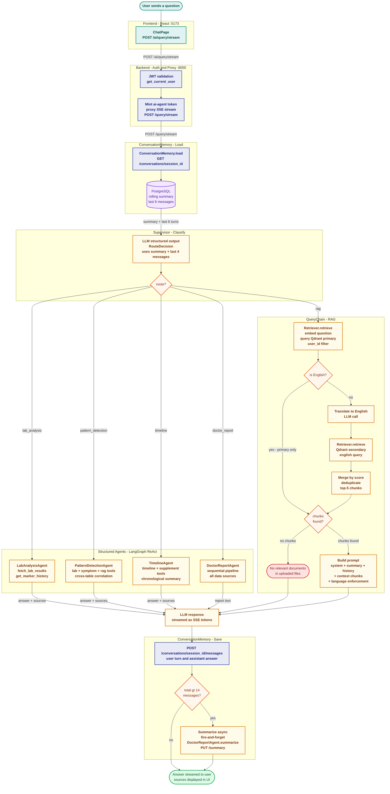

# Flow 2 — Conversational Query (Chat)

> **Services** · Frontend `React :5173` · Backend `FastAPI + PostgreSQL :8000` · AI-Agent `FastAPI + Qdrant :8001`

A user question travels through the backend auth proxy, loads conversation history, is classified by a LangGraph supervisor, and is routed to one of five sub-agents. The answer streams back as Server-Sent Events; the turn is then persisted and optionally compressed into a rolling summary.

---

## Pipeline Diagram

---

## Steps at a Glance

| # | Step | Service · Component | Output |
|---|------|---------------------|--------|
| 1 | User submits question | Frontend `ChatPage` | `POST /ai/query/stream` with `session_id` |
| 2 | Auth + proxy | Backend `get_current_user` → proxy route | JWT validated; new short-lived token minted for ai-agent |
| 3 | Load history | AI-Agent `ConversationMemory.load` | Rolling summary + last 6 messages from PostgreSQL |
| 4 | Classify | AI-Agent `Supervisor._classify` | `RouteDecision` — one of 5 routes |
| 5a | Lab analysis | `LabAnalysisAgent` ReAct loop | Calls `fetch_lab_results` / `get_marker_history` → Backend |
| 5b | Pattern detection | `PatternDetectionAgent` ReAct loop | Calls lab + symptom + rag tools; cross-table correlation |
| 5c | Timeline | `TimelineAgent` ReAct loop | Calls timeline + supplement tools → Backend |
| 5d | Doctor report | `DoctorReportAgent` sequential pipeline | Aggregates all data; generates structured report |
| 5e | RAG | `QueryChain` — embed → retrieve → prompt → LLM | Semantic Qdrant search; optional dual retrieval for Hebrew |
| 6 | Stream answer | LLM → SSE → Backend proxy → Frontend | `{"token": "..."}` events; final `{"sources": [...]}` event |
| 7 | Save turn | `ConversationMemory.save_turn` | 2 messages written to PostgreSQL (user + assistant) |
| 8 | Maybe summarize | `ConversationMemory.maybe_summarize` | If total > 14 messages → async summarization, fire-and-forget |

---

## Key Design Decisions

| Decision | Rationale |
|----------|-----------|
| **Backend as auth proxy** | The ai-agent port stays private; all auth logic lives in one place — the backend validates the user JWT and mints a scoped token for the ai-agent |
| **Rolling summary + last 6 verbatim** | Older turns are compressed into a summary (via LLM) while recent turns stay verbatim — gives the classifier follow-up context without growing the prompt unboundedly |
| **Summarization at 14 messages** | 14 messages ≈ 7 back-and-forth turns — long enough for context to dilute relevance more than it adds value; threshold is a single constant |
| **Async fire-and-forget summarization** | Summarization is an LLM call that doesn't block the response — the user sees the answer immediately; the summary is ready for the next turn |
| **Classify with history** | The last 4 raw messages are included in the classification prompt so follow-up questions ("what about my iron?") are routed correctly instead of always defaulting to RAG |
| **Fallback to RAG on classifier error** | Any exception in structured output parsing routes to `rag` — the safest general-purpose handler |
| **Dual retrieval for Hebrew queries** | The corpus mixes Hebrew Clalit PDFs and English journals; translating the query and searching twice then merging by score ensures cross-language hits |
| **Language enforcement in prompt** | A `CRITICAL` system message immediately before the question overrides any language bleed from Hebrew document chunks in the context |
| **SSE token streaming** | Each LLM token is forwarded as a `data: {"token": "..."}` event; the final event carries `sources` — the frontend can render progressively without waiting for the full answer |

---

## Route Classification

| Route | When | Sub-agent / Handler | Data sources |
|-------|------|---------------------|--------------|
| `lab_analysis` | Questions about specific markers, values, reference ranges, trends for one marker | `LabAnalysisAgent` ReAct | `GET /lab-results` — PostgreSQL `lab_results` + `lab_markers` |
| `pattern_detection` | Correlations across data types, causes, symptom/energy changes over time | `PatternDetectionAgent` ReAct | lab + symptom + rag tools — PostgreSQL + Qdrant |
| `timeline` | Chronological summaries, when events started/stopped, current supplement status | `TimelineAgent` ReAct | `GET /timeline` + `GET /supplements` — PostgreSQL |
| `doctor_report` | Structured report for a doctor appointment, full health summary | `DoctorReportAgent` sequential | All PostgreSQL tables + Qdrant |
| `rag` | General questions, document content, diet, doctor notes, anything else | `QueryChain` RAG | Qdrant `health_documents` collection |
