# Flow 3 — RAG Retrieval (within the Query Flow)

> **Service** · AI-Agent `FastAPI + Qdrant :8001`
> **Triggered when** · Supervisor classifies route as `rag` — general questions, document content, diet notes, doctor notes, anything that doesn't fit a structured agent

The RAG path handles every question that isn't targeted at a specific structured data type. It embeds the question, retrieves the most relevant chunks from Qdrant, builds a layered prompt with conversation context, and streams the LLM response back.

---

## Pipeline Diagram

```mermaid
flowchart TD
    classDef ai     fill:#FFFBEB,stroke:#D97706,stroke-width:2px,color:#78350F,font-weight:bold
    classDef store  fill:#F3E8FF,stroke:#7C3AED,stroke-width:2px,color:#4C1D95
    classDef decide fill:#FFF7ED,stroke:#EA580C,stroke-width:2px,color:#7C2D12
    classDef err    fill:#FEE2E2,stroke:#DC2626,stroke-width:2px,color:#7F1D1D
    classDef done   fill:#DCFCE7,stroke:#16A34A,stroke-width:2px,color:#14532D
    classDef layer  fill:#F0FDF4,stroke:#16A34A,stroke-width:1px,color:#14532D

    START(["question + user_id + conversation context\nSupervisor routed to QueryChain"]):::ai

    subgraph PRIMARY[Step 1 - Primary Retrieval - always runs]
        PR1["Embedder.embed\nmultilingual-e5-large\n1024-dim query vector\nCPU - FastEmbed"]:::ai
        PR2[("Qdrant query_points\ncollection: health_documents\nfilter: user_id required\noptional: document_type\noptional: date_from date_to\ntop-5 by cosine similarity")]:::store
    end

    LCHECK{"is_english\nASCII alpha ratio\ngt 80% = English?"}:::decide

    subgraph DUAL[Step 2 - Dual Retrieval - non-English queries only]
        DS1["Translate to English\nLLM call\nTRANSLATE_TO_ENGLISH_PROMPT\nreturns plain English text"]:::ai
        DS2["Embedder.embed\nenglish translation\n1024-dim vector"]:::ai
        DS3[("Qdrant query_points\nsame user_id filter\nsecondary search\ntop-5 by cosine score")]:::store
        DS4["Merge primary + secondary\nsort all chunks by cosine score\ndeduplicate by chunk id\nfinal top-5"]:::ai
    end

    HCHECK{"no chunks\nAND no history?"}:::decide
    RNONE(["No relevant documents\nfound in uploaded files"]):::err

    subgraph PROMPT[Step 3 - Prompt Construction - ordered layers]
        PL1["Layer 1 - always\nSystemMessage SYSTEM_PROMPT\nrole + 6 guidelines + 5 safety rules"]:::layer
        PL2["Layer 2 - if summary\nSystemMessage\nrolling summary of older turns"]:::layer
        PL3["Layer 3 - if recent history\nHumanMessage or AIMessage\nlast 6 messages verbatim"]:::layer
        PL4["Layer 4 - if NO prior history\nSystemMessage new-session guard\nno prior context exists"]:::layer
        PL5["Layer 5 - if chunks found\nSystemMessage\nchunks formatted as\ntype date filename text"]:::layer
        PL6["Layer 6 - always\nSystemMessage language enforcement\nCRITICAL reply in user language\noverrides Hebrew chunk influence"]:::layer
        PL7["Layer 7 - always\nHumanMessage\noriginal question in user language"]:::layer
    end

    subgraph STREAM[Step 4 - LLM Generation]
        ST1["LLM.astream\nOpenAI GPT-4.1-nano\ntoken-by-token"]:::ai
        ST2["SSE yield per token\ndata: token string"]:::ai
        ST3["SSE final event\ndata: sources array\nfilename type date score per chunk"]:::ai
    end

    DONE(["answer + source chunks\nreturned to Supervisor\nproxied as SSE to Frontend"]):::done

    START   --> PR1
    PR1     --> PR2
    PR2     --> LCHECK

    LCHECK  -->|yes - use primary only| HCHECK
    LCHECK  -->|no| DS1
    DS1     --> DS2
    DS2     --> DS3
    DS3     --> DS4
    DS4     --> HCHECK

    HCHECK  -->|yes| RNONE
    HCHECK  -->|no| PL1

    PL1     --> PL2
    PL2     --> PL3
    PL3     --> PL4
    PL4     --> PL5
    PL5     --> PL6
    PL6     --> PL7

    PL7     --> ST1
    ST1     --> ST2
    ST2     --> ST3
    ST3     --> DONE
    RNONE   --> DONE
```

---

## Steps at a Glance

| # | Step | Component | Notes |
|---|------|-----------|-------|
| 1 | Embed + primary search | `Embedder` → `Retriever.retrieve` | Always runs; filter: `user_id` required, `document_type` + date range optional |
| 2a | Language detection | `is_english()` | ASCII alpha ratio heuristic — >80% ASCII = English |
| 2b | English: done | — | Use primary chunks directly |
| 2c | Non-English: translate | `LLM.ainvoke(TRANSLATE_TO_ENGLISH_PROMPT)` | One extra LLM call |
| 2d | Non-English: secondary search | `Retriever.retrieve(english_query)` | Same Qdrant collection, same filters |
| 2e | Non-English: merge | `_merge_chunks` | Sort by score, deduplicate by chunk id, top-5 |
| 3 | Context check | — | If no chunks AND no history → immediate "no relevant documents" |
| 4 | Build prompt | 7-layer message list | Order matters — see prompt layer table below |
| 5 | Stream LLM | `LLM.astream` | GPT-4.1-nano; each token yielded as `data: {"token": "..."}` |
| 6 | Final SSE event | — | `data: {"sources": [...]}` — chunk metadata for frontend citations |

---

## Prompt Layer Reference

| Layer | Type | Condition | Content |
|-------|------|-----------|---------|
| 1 | `SystemMessage` | Always | `SYSTEM_PROMPT` — role definition, 6 answer guidelines, 5 safety rules (observations only, no causation, doctor referral, uncertainty, no dosage advice) |
| 2 | `SystemMessage` | If `summary` exists | Rolling LLM-generated summary of older conversation turns |
| 3 | `HumanMessage` / `AIMessage` | If `recent_history` exists | Last 6 messages verbatim |
| 4 | `SystemMessage` | If NO history at all | New-session guard — tells LLM there is no prior context, preventing hallucinated memory |
| 5 | `SystemMessage` | If chunks found | Retrieved chunks formatted as `[type | date | filename]\ntext`, separated by `---` |
| 6 | `SystemMessage` | Always | Language enforcement — `CRITICAL` instruction to reply in the same language as the question; overrides Hebrew content influence |
| 7 | `HumanMessage` | Always | The original question in the user's language |

Layers 2 + 3 and layer 4 are mutually exclusive: if there is any history, layers 2/3 are added and layer 4 is skipped; if there is no history, only layer 4 is added.

---

## Key Design Decisions

| Decision | Rationale |
|----------|-----------|
| **Primary retrieval always runs first** | The primary (native-language) search is always the best signal — dual retrieval is additive, not a replacement |
| **ASCII ratio for language detection** | No external library required; reliably separates Hebrew (Clalit PDFs) from English at >80% ASCII alpha threshold — fast and deterministic |
| **Dual retrieval instead of translating documents** | Translating documents at index time would lose the original text; translating only the query at query time keeps originals intact and adds no storage cost |
| **Merge by cosine score** | Cross-language results land on different score scales; sorting by score before deduplication ensures the highest-confidence chunks win regardless of source query |
| **`no_context` guard** | Without this check, an LLM with no relevant documents would hallucinate answers from its training data — returning a clear "no relevant documents" message is strictly better |
| **New-session `SystemMessage` (layer 4)** | Without explicit notification, the LLM may invent a prior conversation from document content ("as we discussed earlier…"); the guard prevents this entirely |
| **Language enforcement as the last system message before the question** | Placing it immediately before the user question makes it the most prominent instruction, overriding any language drift from Hebrew document chunks earlier in the prompt |
| **Sources as the final SSE event** | Chunks are known before generation starts; emitting them as the last event lets the frontend begin rendering the answer immediately without waiting for metadata |

---

## Qdrant Chunk Payload

Each point stored by `QdrantWriter` during ingestion carries this payload, which is returned in the `sources` array:

| Field | Type | Description |
|-------|------|-------------|
| `text` | `str` | The chunk text (500-char window, 50-char overlap) |
| `document_id` | `str` | UUID of the source document in PostgreSQL |
| `user_id` | `str` | Mandatory retrieval filter — cross-user isolation |
| `document_type` | `str` | `blood_test`, `lab_report`, `symptom_note`, etc. |
| `source_date` | `str \| null` | ISO date from document metadata |
| `filename` | `str` | Original filename for display |
| `chunk_index` | `int` | Position within the document |
